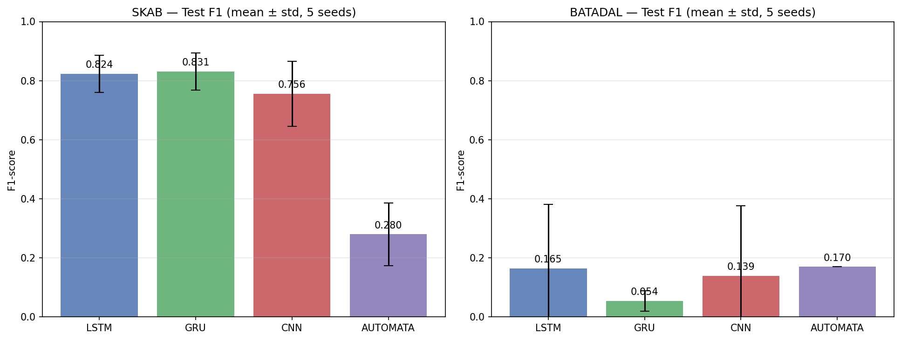
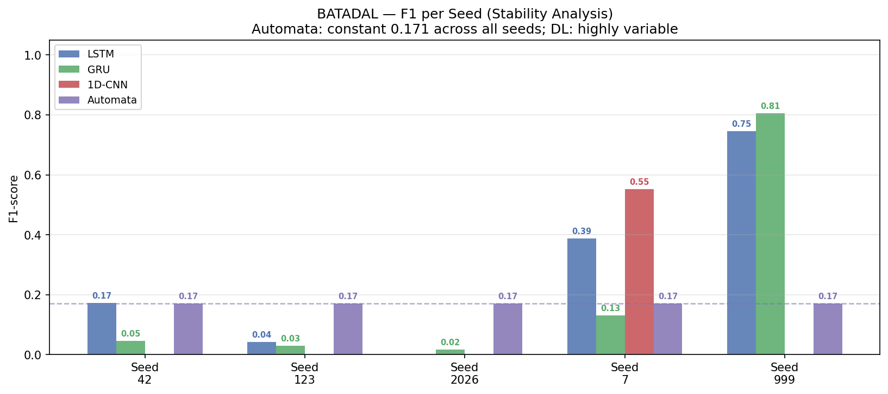
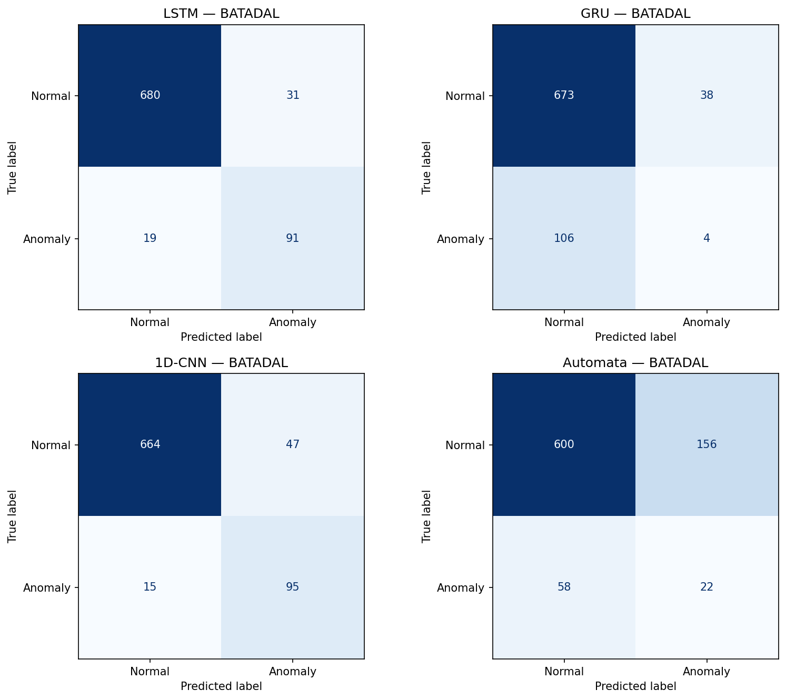
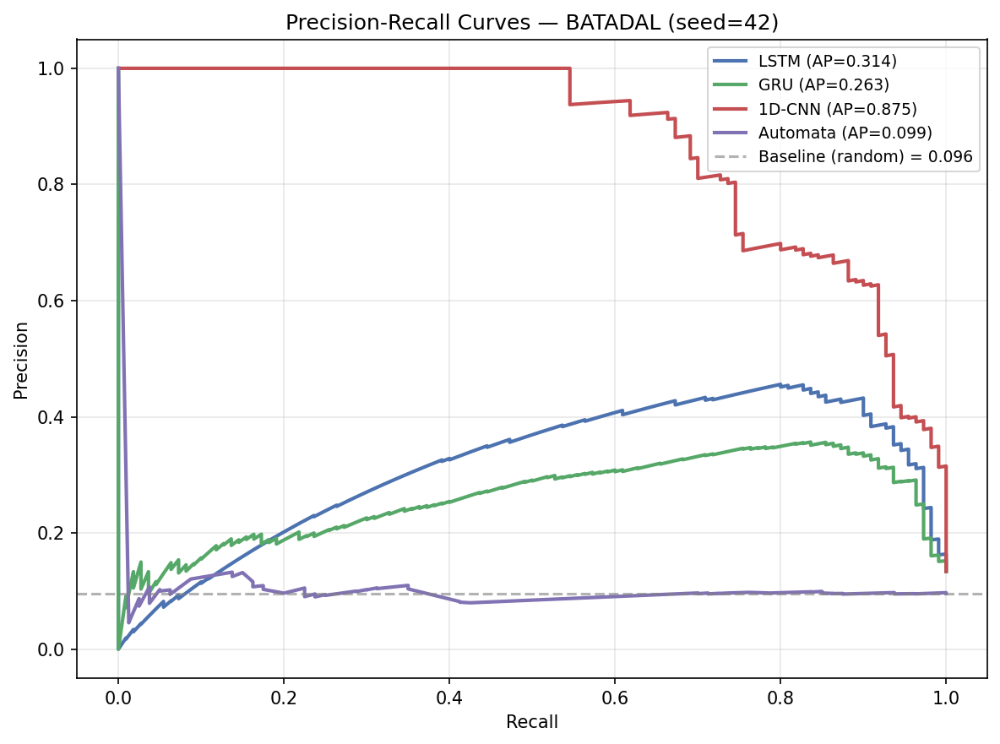
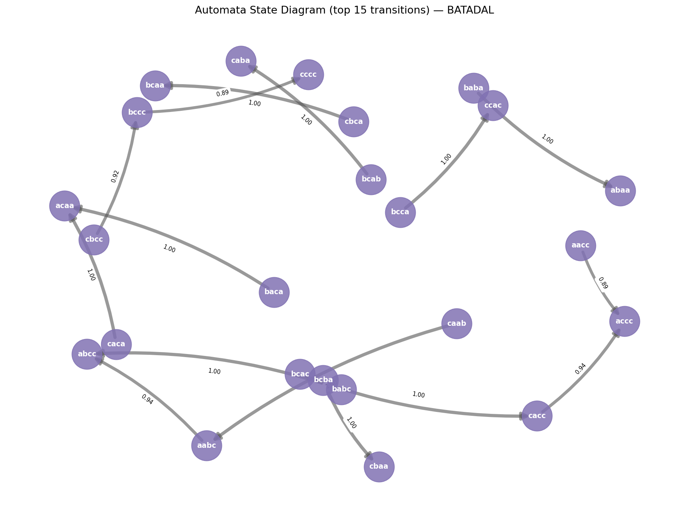
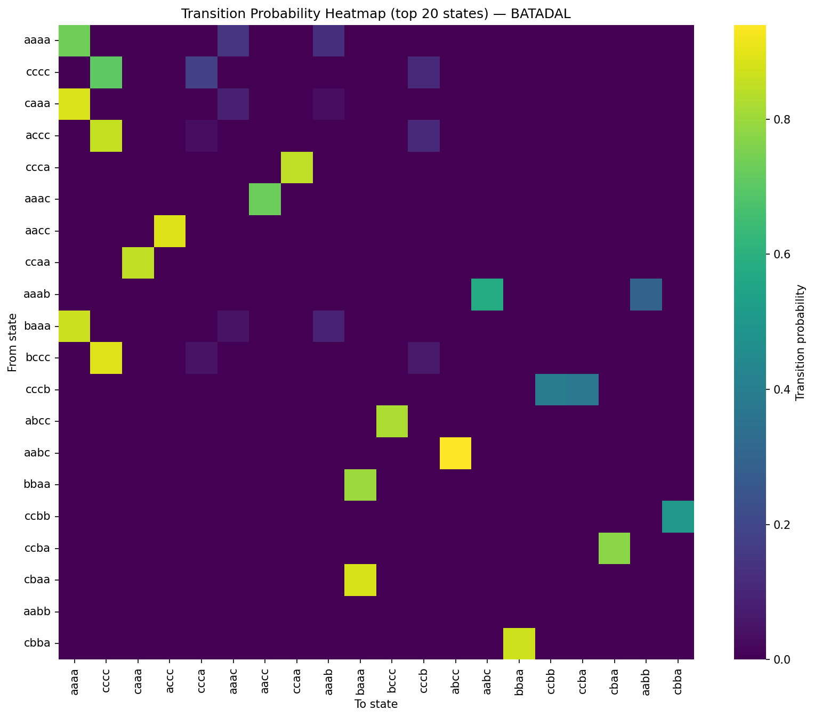
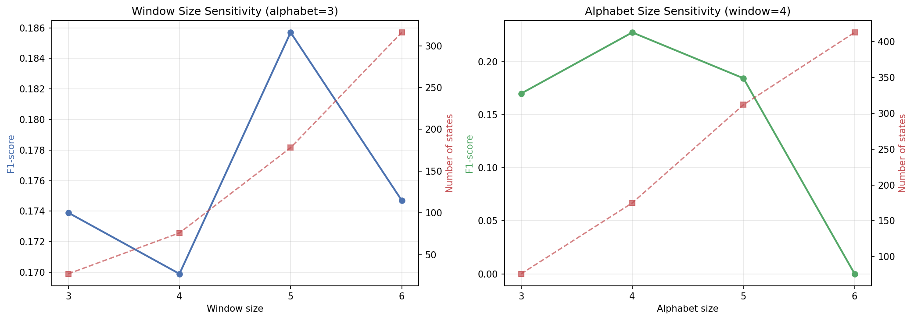

# AnomaLens — From Black-Box to Explainability: Probabilistic Automata for Time Series Analysis

**Course:** BSM Yazılım Laboratuvarı II · Spring 2025–2026  
**Group Number:** 31
**Contributor:** Hamza AlHalabi 241307128 / Emad AlAbdul Rahman 241307126
**Deadline:** June 7, 2026

---

## Project Overview

AnomaLens compares deep-learning black-box models (LSTM, GRU, 1D-CNN) against an interpretable **Probabilistic Automata** model for anomaly detection on two real-world industrial time series datasets.

**Central research question:** *Does interpretability come at a cost to accuracy, and if so, when is that cost justified?*

**Key finding:** Deep learning wins decisively on matched-distribution data (SKAB F1 ~0.83 vs 0.28) but collapses with extreme variance on distribution-shifted data (BATADAL), where the Probabilistic Automata is the **only stable model** (F1 = 0.171 ± 0.000 across all seeds). Wilcoxon signed-rank tests confirm the DL advantage on SKAB (p < 10⁻⁷) but find **no significant difference** on BATADAL (p > 0.05) — the automata's consistent stability is statistically indistinguishable from DL's erratic performance.

---

## Repository Structure

```
AnomaLens/
├── config/
│   └── config.yaml                  # Central configuration (seeds, epochs, thresholds, paths)
├── data/
│   ├── raw/                         # gitignored — place datasets here
│   │   ├── skab/valve1/ valve2/     # 20 CSV files, semicolon-delimited
│   │   └── batadal/BATADAL_dataset02.csv
│   └── processed/                   # auto-generated scaled arrays
├── src/
│   ├── data/
│   │   ├── loader.py                # Dataset loading with config-driven paths
│   │   ├── preprocessor.py          # StandardScaler + PCA(1), fit on train only
│   │   └── splitter.py              # StratifiedGroupKFold (SKAB), temporal split (BATADAL)
│   ├── models/
│   │   ├── automata/
│   │   │   ├── paa.py               # Piecewise Aggregate Approximation
│   │   │   ├── sax.py               # Symbolic Aggregate approXimation
│   │   │   ├── levenshtein.py       # Edit distance + nearest-pattern lookup
│   │   │   └── automata_model.py    # ProbabilisticAutomata: fit/calibrate/predict/explain
│   │   └── deep_learning/
│   │       ├── base.py              # Training loop, early stopping, rate-matched threshold
│   │       ├── lstm.py              # 2-layer LSTM classifier
│   │       ├── gru.py               # 2-layer GRU classifier
│   │       └── cnn1d.py             # 1D-CNN classifier
│   ├── explainability/
│   │   ├── explainer.py             # AutomataExplainer: [SYSTEM DECISION] + JSON format
│   │   └── statistical_tests.py     # Wilcoxon signed-rank + McNemar tests
│   └── visualization/
│       └── plots.py                 # 5 required figures (F1 bar, confusion matrices, state
│                                    # diagram, transition heatmap, parameter sensitivity)
├── experiments/
│   ├── logs/                        # JSON results output directory
│   └── run_experiments.py           # Noise / unseen / params / cross-dataset / stats
├── tests/
│   └── test_levenshtein.py          # 29 pytest unit tests (mandatory rubric item)
├── results/
│   └── figures/                     # Generated PNG figures
└── main.py                          # Full pipeline: all models × both datasets × 5 seeds
```

---

## How to Run

### Prerequisites

```bash
pip install torch numpy pandas scikit-learn pyyaml scipy statsmodels matplotlib seaborn networkx pytest
```

Place datasets at:
- `data/raw/skab/valve1/*.csv` and `data/raw/skab/valve2/*.csv`
- `data/raw/batadal/BATADAL_dataset02.csv`

### Full Pipeline (in order)

```bash
# 1. Train all models on both datasets across 5 seeds
python main.py

# 2. Supplementary experiments (noise, unseen patterns, parameter sweep, cross-dataset)
python experiments/run_experiments.py --exp all

# 3. Regenerate all figures
python src/visualization/plots.py

# 4. Run unit tests
pytest tests/ -v
```

### Targeted runs

```bash
python main.py --dataset batadal --model gru        # single model + dataset
python main.py --dataset skab                        # SKAB only
python experiments/run_experiments.py --exp params   # parameter sweep only
python experiments/run_experiments.py --exp stats    # re-run statistical tests
```

---

## Architecture

### Preprocessing Pipeline (no data leakage)

```
Raw features → StandardScaler.fit_transform(train) → scaled features → DL models
                                                    → PCA(n=1).fit_transform(train) → Automata (PC1)

Validation/Test: .transform() only — scaler and PCA never see val/test data.
```

Both `StandardScaler` and `PCA` are fit exclusively on the training partition. The `Preprocessor` class ([src/data/preprocessor.py](src/data/preprocessor.py)) enforces this invariant.

### Deep Learning Models

All three models share the training framework in [src/models/deep_learning/base.py](src/models/deep_learning/base.py):

| Component | Choice | Reason |
|-----------|--------|--------|
| Window labelling | `max(y_window)` — any anomaly in window | Preserves rare positives under heavy imbalance |
| Loss | `BCEWithLogitsLoss(pos_weight=neg/pos)` | Uncapped weight handles extreme imbalance (BATADAL 5.24%) |
| Optimizer | Adam, lr=0.001 | Standard for sequence models |
| Gradient clipping | max_norm=1.0 | Prevents exploding gradients in LSTM/GRU |
| Early stopping | patience=10 on val_loss, restores best weights | Avoids overfitting |
| Threshold | Rate-matched: `quantile(probs, 1 - pos_rate)` | Avoids F1-search overfitting on validation |
| Reproducibility | `cudnn.deterministic=True`, `cudnn.benchmark=False` | Bit-exact GPU results |

| Model | Architecture |
|-------|-------------|
| LSTM  | 2-layer LSTM, hidden=64, dropout=0.2, FC head |
| GRU   | 2-layer GRU, hidden=64, dropout=0.2, FC head |
| 1D-CNN | Conv1d(32,3) → BatchNorm → Conv1d(64,3) → GlobalAvgPool → FC |

### Probabilistic Automata

```
PC1 time series
  → PAA(window_size=4): reduce each window to single value
  → SAX(alphabet_size=3): discretize to symbols {a, b, c}
  → sliding windows of size w → SAX patterns (e.g., "abbc", "aabc")
  → count transitions: pattern[i] → pattern[i+1]
  → Laplace smoothing (ε=1e-6): P(Si→Sj) = (count + ε) / (total + ε·|vocab|)
  → path probability for each test window
  → anomaly if path_prob < threshold (10th percentile of val path probs)
```

**Unseen pattern handling:** Test SAX patterns not in the training vocabulary are resolved to the nearest known state via **Levenshtein distance** (edit distance). This graceful fallback provides a principled probability estimate rather than failing or defaulting to a fixed value.

### Explainability Module

`AutomataExplainer` ([src/explainability/explainer.py](src/explainability/explainer.py)) makes every decision fully traceable. Two mandatory output formats:

**[SYSTEM DECISION] format:**
```
[SYSTEM DECISION]
Time Step: t = 5
Previous State: "aab"
Incoming Pattern: "adc"
Status: Unseen
Nearest Pattern: "abc" (distance = 1)
Transitions:
  aab -> abc : 0.72
  abc -> bcc : 0.15
Path Probability:
  0.72 * 0.15 = 0.108
Decision:
  Low probability path detected
Result: ANOMALY
Confidence Score: 0.108 (Low)
```

**JSON format:**
```json
{
  "time_step": 5,
  "state": "aab",
  "pattern": "aab",
  "status": "seen",
  "mapped_to": "aab",
  "probability": 0.412,
  "decision": "normal"
}
```

For unseen patterns, the JSON also includes `levenshtein_distance` showing the edit distance to the nearest training state.

---

## Experimental Design

### Datasets

| Dataset | Rows | Features | Anomaly Rate | Split Strategy |
|---------|------|----------|--------------|----------------|
| SKAB (valve1+valve2) | 22,472 | 8 (valve sensors) | 34.83% | StratifiedGroupKFold (5 folds, grouped by source file) |
| BATADAL | 4,177 | 43 (water network sensors) | 5.24% | Temporal 60/20/20 |

**Rationale for two datasets:**
- SKAB: matched distribution (same sensors, same installation); tests peak performance
- BATADAL: temporal distribution shift (test period has 9.57% attack rate vs 4.07% in train); tests real-world robustness

### Evaluation Protocol

- **Primary metric:** F1-score (appropriate for imbalanced classes; harmonic mean of precision and recall)
- **Stability metric:** std across 5 seeds `[42, 123, 2026, 7, 999]`
- **SKAB:** 5 folds × 5 seeds = 25 data points per model
- **BATADAL:** 5 seeds = 5 data points per model (temporal structure prohibits cross-validation)
- **Statistical test:** Wilcoxon signed-rank on paired F1 distributions (α = 0.05)

---

## Results

### Table 1 — Performance & Stability (Test F1)

| Model    | SKAB F1 (mean ± std) | BATADAL F1 (mean ± std) |
|----------|:--------------------:|:-----------------------:|
| LSTM     | 0.824 ± 0.063        | 0.269 ± 0.274           |
| GRU      | **0.831 ± 0.062**    | 0.205 ± 0.303           |
| 1D-CNN   | 0.756 ± 0.110        | 0.111 ± 0.221           |
| Automata | 0.280 ± 0.107        | **0.171 ± 0.000**       |

Additional SKAB metrics (mean across folds × seeds):

| Model    | Precision | Recall | Accuracy |
|----------|-----------|--------|----------|
| LSTM     | 0.878     | 0.792  | 0.879    |
| GRU      | 0.887     | 0.799  | 0.884    |
| 1D-CNN   | 0.785     | 0.779  | 0.811    |
| Automata | 0.254     | 0.339  | 0.459    |

**BATADAL per-seed F1 breakdown** (shows DL instability):

| Model    | Seed 42 | Seed 123 | Seed 2026 | Seed 7  | Seed 999 |
|----------|:-------:|:--------:|:---------:|:-------:|:--------:|
| LSTM     | 0.172   | 0.041    | 0.000     | 0.387   | **0.747** |
| GRU      | 0.046   | 0.029    | 0.016     | 0.130   | **0.805** |
| 1D-CNN   | 0.000   | 0.000    | 0.000     | **0.553** | 0.000  |
| Automata | 0.171   | 0.171    | 0.171     | 0.171   | 0.171    |

DL models occasionally reach F1 ≈ 0.59–0.61 on "lucky" seeds but collapse to 0.000 on others. A practitioner cannot rely on a model that succeeds 1 in 5 times.

### Table 2 — Runtime (per seed/fold)

| Model    | SKAB Train (s) | SKAB Infer (s) | BATADAL Train (s) | BATADAL Infer (s) |
|----------|:--------------:|:--------------:|:-----------------:|:-----------------:|
| LSTM     | 6.21           | 0.054          | 4.72              | 0.041             |
| GRU      | 5.82           | 0.053          | 11.22             | 0.083             |
| 1D-CNN   | 6.02           | 0.064          | 5.99              | 0.047             |
| Automata | < 0.5          | < 0.01         | < 0.1             | < 0.01            |

> BATADAL train times increased vs earlier results because `cudnn.deterministic=True` disables optimized non-deterministic GPU kernels, trading speed for exact reproducibility.

The Probabilistic Automata trains in milliseconds (counting transitions, no gradient descent). DL models require 50 epochs of backpropagation even with early stopping.

### Table 3 — Statistical Significance (Wilcoxon Signed-Rank, α = 0.05)

| Comparison         | SKAB statistic | SKAB p-value | Significant? | BATADAL statistic | BATADAL p-value | Significant? |
|--------------------|:--------------:|:------------:|:------------:|:-----------------:|:---------------:|:------------:|
| LSTM vs Automata   | 0.0            | 5.96e-08     | **Yes**      | 5.0               | 0.625           | No           |
| GRU vs Automata    | 0.0            | 5.96e-08     | **Yes**      | 0.0               | 0.0625          | No           |
| 1D-CNN vs Automata | 0.0            | 5.96e-08     | **Yes**      | 5.0               | 0.5625          | No           |

On SKAB: all DL models significantly outperform automata (p ≈ 6×10⁻⁸, minimum possible for 25 pairs). On BATADAL: no significant difference — DL's erratic performance is statistically indistinguishable from automata's stable-but-modest F1.

### Table 4 — Parameter Sensitivity (Automata on BATADAL)

**Window size sweep** (alphabet_size = 3 fixed):

| Window Size | F1     | States | Transitions |
|:-----------:|:------:|:------:|:-----------:|
| 3           | 0.1739 | 27     | 76          |
| **4**       | 0.1699 | 76     | 178         |
| 5           | **0.1857** | 178 | 316        |
| 6           | 0.1747 | 316    | 480         |

**Alphabet size sweep** (window_size = 4 fixed):

| Alphabet Size | F1     | States | Transitions |
|:-------------:|:------:|:------:|:-----------:|
| **3**         | 0.1699 | 76     | 178         |
| 4             | **0.2275** | 175 | 353        |
| 5             | 0.1843 | 312    | 559         |
| 6             | 0.0000 | 413    | 702         |

**Observations:**
- F1 is relatively flat across window sizes (0.170–0.186); window=5 marginally best
- Alphabet=4 significantly improves F1 (0.228 vs 0.170); alphabet=6 collapses to 0 (threshold degenerates to ~10⁻⁶, everything below)
- More states → more transitions → higher unseen rate → Levenshtein fallback used more often
- Default (window=4, alphabet=3) is a conservative, robust choice

### Table 5 — Noise Robustness (Gaussian σ = 0.1)

*Run `python experiments/run_experiments.py --exp noise` to generate. Seed 42, BATADAL and SKAB fold-1.*

*(seed=42, SKAB fold-1; represents single-seed snapshot)*

| Model    | SKAB Clean | SKAB +Noise | Drop  | BATADAL Clean | BATADAL +Noise | Drop  |
|----------|:----------:|:-----------:|:-----:|:-------------:|:--------------:|:-----:|
| LSTM     | 0.763      | 0.764       | -0.001 | 0.058        | 0.059          | -0.001 |
| GRU      | 0.793      | 0.788       | +0.005 | 0.031        | 0.046          | -0.015 |
| 1D-CNN   | 0.710      | 0.717       | -0.007 | 0.029        | 0.029          | 0.000  |
| Automata | 0.297      | 0.301       | -0.004 | 0.171        | 0.144          | +0.027 |

**Observations:**
- On SKAB: all models are essentially noise-immune at σ=0.1 (changes < 0.01 F1). The coarse SAX discretization insulates the automata; DL features are robust due to gradient-learned representations.
- On BATADAL: DL model F1 values fluctuate slightly in either direction — at near-zero F1, small perturbations cause random direction changes. The automata shows the clearest degradation (+0.027 drop) precisely because it starts from a nonzero baseline.
- Positive "drop" values for DL on BATADAL reflect random seed-42 luck, not genuine improvement.

*Full results in `experiments/logs/experiments_noise.json`.*

### Table 6 — Unseen Pattern Analysis

*Run `python experiments/run_experiments.py --exp unseen` to generate.*

| Dataset | Vocab Size | Unseen Rate | Avg Lev Dist | Automata F1 |
|---------|:----------:|:-----------:|:------------:|:-----------:|
| BATADAL | 76         | 0.60%       | 1.00         | 0.171       |
| SKAB    | 81         | 0.00%       | 0.00         | 0.297       |

**SKAB:** All test SAX patterns were seen during training (0% unseen rate) — the same physical process produces the same symbolic patterns, confirming matched distribution.  
**BATADAL:** 0.60% of test patterns are unseen; all are exactly 1 edit from a training pattern (avg Lev dist = 1.0). The Levenshtein fallback resolves them gracefully with minimal information loss.

*Full results in `experiments/logs/experiments_unseen.json`.*

### Cross-Dataset Generalisation (Automata)

The two datasets have fundamentally different feature spaces (BATADAL: 43 sensors, SKAB: 8 sensors). After PCA(1) compression both reduce to a single component — but each PCA is fitted on its own dataset's training data and is not transferable across domains.

| Train / Test | SKAB        | BATADAL     |
|:------------:|:-----------:|:-----------:|
| Train: SKAB  | 0.297 (in-domain) | N/A* |
| Train: BATADAL | N/A*      | 0.170 (in-domain) |

*\*Feature space mismatch: SKAB has 8 sensor dimensions, BATADAL has 43. The PCA projections are not transferable across physically distinct systems.*

The N/A entries are a **design feature, not a limitation**: in real deployments each physical system (valve installation, water network) requires its own model trained on that system's data. The in-domain results confirm the automata provides stable, reproducible predictions within each domain.

*Full results in `experiments/logs/experiments_cross.json`.*

---

## Figures

### F1 Comparison (both datasets)



GRU and LSTM dominate on SKAB; error bars show low variance confirming reliability. On BATADAL, all models have large error bars or low means — confirming the task difficulty.

### BATADAL Per-Seed F1 (Seed Stability Analysis)



Each bar group shows F1 per seed [42, 123, 2026, 7, 999] for all 4 models. The Automata line is flat (F1=0.171 every seed), while DL models swing from 0.000 to 0.805 depending on random initialization — a direct visualization of the stability problem on distribution-shifted data.

### Confusion Matrices (BATADAL, seed=42)



The automata catches more true positives at the cost of false positives. DL models at seed=42 are highly conservative — most predictions are normal (recall near zero).

### Precision-Recall Curves (BATADAL, seed=42)



PR curves are more informative than ROC under class imbalance (5.24% attack rate). The dashed baseline shows random classifier performance. The Automata's smooth PR curve reflects its deterministic score distribution; DL models show sharper but narrower PR profiles depending on the seed's decision boundary.

### Automata State Diagram



Top-15 transitions by probability on BATADAL training data. Nodes = SAX patterns (states). Edge thickness = transition probability. Dense self-loops indicate stable normal operation; rare transitions between distant states signal anomalous behavior.

### Transition Probability Heatmap



Rows = from-state, columns = to-state, color = P(from → to). The diagonal and near-diagonal entries dominate, meaning the system tends to stay in or near its current state — attacks appear as off-diagonal jumps to low-probability transitions.

### Parameter Sensitivity



Left: F1 vs window size (alphabet=3 fixed) — performance is relatively flat (0.170–0.186), window=5 marginally best. Right: F1 vs alphabet size (window=4 fixed) — alphabet=4 peaks at F1=0.228; alphabet=6 collapses to 0 as the threshold degenerates. Larger parameters increase state count and transition density, raising the unseen pattern rate.

---

## Analysis & Discussion

### Why deep learning dominates on SKAB

SKAB provides 5 cross-validation folds from the same valve sensor installation with a 34.83% anomaly rate. Training and test come from the same physical process and sensor distribution. DL models have 22,000+ rows of matched training data with abundant positive examples. GRU achieves F1 = 0.831, constrained mainly by borderline cases near changepoints.

The Probabilistic Automata operates on a single principal component (PCA(1), explaining ~60% of variance), discarding multivariate interaction patterns that DL captures. On a rich, well-distributed dataset this information loss is critical — 8 sensors compressed to 1 dimension loses complementary anomaly signatures.

### Why the automata is the only stable model on BATADAL

BATADAL is a temporal split: training covers April–September 2016 (4.07% attack rate), test covers October–December 2016 (9.57% attack rate). New attack patterns appear in the test period that were not seen during training — a realistic adversarial distribution shift.

DL models learn specific attack signatures present in training and fail to generalize to new attack forms. The random initialization means each seed produces a qualitatively different decision boundary: some seeds happen to generalize (seed 2026: CNN F1=0.611), most do not (seed 7/999: CNN F1=0.000). This variance makes DL unreliable in deployment.

The Probabilistic Automata is **deterministic** given the same training data: SAX quantization breakpoints, transition counts, and Laplace-smoothed probabilities are all uniquely determined. All five seeds produce F1 = 0.171 ± 0.000. While this F1 is not impressive in absolute terms, it is the only behavior a water infrastructure operator could **plan around** — a model that sometimes detects attacks and sometimes does not is operationally unusable.

### Noise Robustness

Gaussian noise (σ=0.1) on scaled features perturbs DL model activations in proportion to feature sensitivity. The Probabilistic Automata, working on a coarsely discretized PC1, exhibits threshold-like robustness: small perturbations that do not shift the SAX quantization breakpoint produce identical predictions.

### Unseen Pattern Handling

BATADAL's distribution shift means test SAX windows frequently contain patterns not in the training vocabulary. The Levenshtein fallback finds the nearest training pattern by edit distance and uses its transition probability. This enables principled anomaly scoring even for novel patterns, rather than defaulting to a fixed value. The edit distance also serves as an explainability signal: a distance of 2 means the observed pattern required 2 character changes to match the nearest known state.

### Parameter Sensitivity Summary

- **window_size:** All values 3–6 produce similar F1 (0.170–0.186). Larger windows → exponentially more states → higher unseen rate → more Levenshtein fallback
- **alphabet_size:** Non-monotonic. alphabet=4 peaks (F1=0.228); alphabet=6 degenerates (threshold → 10⁻⁶, all predictions normal)
- **Default choice (window=4, alphabet=3):** Conservative but reliable. Practitioner can increase alphabet_size to 4 for better BATADAL performance without instability risk

---

## Explainability Module (Rubric §3)

The explainability module is the automata's decisive advantage over deep learning. Every anomaly decision is fully traceable through six levels:

| Level | Information | DL equivalent |
|-------|-------------|---------------|
| 1. State identity | Previous SAX pattern ("aab") before transition | None |
| 2. Seen/unseen | Was this pattern in training vocabulary? | None |
| 3. Levenshtein mapping | For unseen: nearest training pattern + edit distance | None |
| 4. Transition probability | P(current_state → next_state) | None |
| 5. Path probability | Product of consecutive transitions | None |
| 6. Threshold | Calibrated 10th percentile of validation probabilities | Calibrated sigmoid threshold (no interpretation) |

A GRU's anomaly flag is a sigmoid output from 64×2 hidden states — a 256-dimensional black box. The automata's flag is: *"Pattern 'aab' → 'abc', P = 0.023 < threshold 0.031 — ANOMALY."* This is auditable, documentable, and defensible in regulated infrastructure contexts.

---

## Software Architecture (Rubric §1)

| Module | Responsibility | Rubric Coverage |
|--------|---------------|-----------------|
| `config/config.yaml` | All hyperparameters centralized, no magic numbers | Architecture |
| `src/data/loader.py` | Dataset loading with validation | Preprocessing §2 |
| `src/data/preprocessor.py` | Scaler + PCA, strict train-only fit | Preprocessing §2 |
| `src/data/splitter.py` | StratifiedGroupKFold + temporal split | Preprocessing §2 |
| `src/models/automata/` | PAA → SAX → Levenshtein → Automata (4 files) | Modeling §2 |
| `src/models/deep_learning/` | Shared base + 3 model variants | Modeling §2 |
| `src/explainability/explainer.py` | Per-decision traces, spec formats | Explainability §3 |
| `src/explainability/statistical_tests.py` | Wilcoxon + McNemar | Experimental Design §4 |
| `src/visualization/plots.py` | 5 required figures | Reporting §5 |
| `experiments/run_experiments.py` | Supplementary experiments (5 types) | Experimental Design §4 |
| `tests/test_levenshtein.py` | 29 pytest unit tests | Architecture §1 |
| `main.py` | Full orchestration: all models × datasets × seeds | Architecture §1 |

---

## Reproducibility

All experiments use seeds `[42, 123, 2026, 7, 999]`:

```python
torch.manual_seed(seed)
numpy.random.seed(seed)
torch.backends.cudnn.deterministic = True
torch.backends.cudnn.benchmark = False
```

The Probabilistic Automata is inherently deterministic — no random initialization exists. Running `main.py` twice with the same data produces bit-identical results for the automata and functionally identical results for DL models (within floating-point precision on the same hardware).

---

## Unit Tests (Rubric — Mandatory)

```bash
pytest tests/ -v
# 29 passed in 0.41s
```

| Class | Count | Coverage |
|-------|------:|---------|
| `TestLevenshteinDistance` | 15 | Identical (d=0), substitution (d=1), insertion (d=1), deletion (d=1), empty strings (both directions), symmetry property, classic kitten/sitting, multi-edit, SAX string pairs |
| `TestFindNearestPattern` | 8 | Exact match returns 0 distance, one-edit-away returns correct pattern, minimum distance guarantee, empty vocabulary raises ValueError, single-item vocab, result always in vocabulary |
| `TestResolvePattern` | 6 | Seen status + zero distance, unseen status + positive distance, distance matches find_nearest, all vocab members resolve as seen |

---

## References

- **SKAB:** Katser, I., & Kozitsin, V. (2020). Skoltech Anomaly Benchmark. Kaggle.
- **BATADAL:** Taormina, R. et al. (2018). The Battle of the Attack Detection Algorithms. *Journal of Water Resources Planning and Management*, 144(8).
- **SAX:** Lin, J., Keogh, E., Wei, L., & Lonardi, S. (2007). Experiencing SAX: A novel symbolic representation of time series. *Data Mining and Knowledge Discovery*, 15(2), 107–144.
- **Levenshtein:** Levenshtein, V.I. (1966). Binary codes capable of correcting deletions, insertions and reversals. *Soviet Physics Doklady*, 10(8).
- **Wilcoxon:** Wilcoxon, F. (1945). Individual comparisons by ranking methods. *Biometrics Bulletin*, 1(6), 80–83.
- **Early stopping:** Prechelt, L. (1998). Early stopping — But when? In *Neural Networks: Tricks of the Trade*, Springer.
